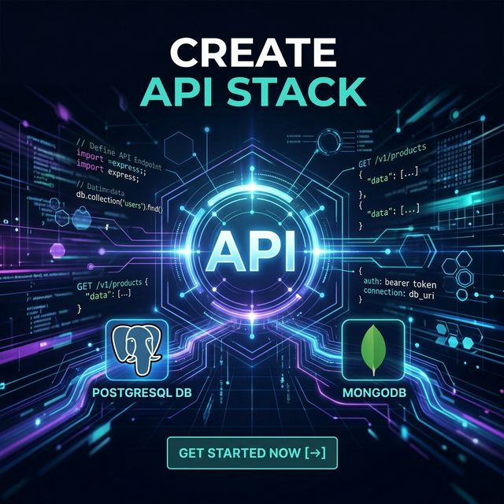

<div align="center">
  

  # Create API Stack 🚀

  **The fastest way to scaffold a robust, production-ready backend API.**

  [](https://www.npmjs.com/package/create-api-stack)
  [](LICENSE)
  [](http://makeapullrequest.com)

  ---

  [Features](#-features) • [Installation](#-installation) • [Quick Start](#-quick-start) • [Roadmap](#-roadmap)

</div>

## ✨ Features

- **⚡ Instant Scaffolding**: Get a working API in seconds.
- **🗄️ Database Ready**: Choose between **MongoDB** and **PostgreSQL**.
- **📦 Docker Support**: Optional Dockerization for consistent environments.
- **TypeScript First**: Optional (but recommended) TypeScript support for type safety.
- **🛠️ Production Best Practices**: Pre-configured with `.env`, `.gitignore`, and modular folder architecture.
- **🔄 Modern Tooling**: Built with **Node.js**, **Inquirer**, and **Chalk** for a delightful CLI experience.

## 🚀 Installation

You can run `create-api-stack` using `npx` without installing it globally:

```bash
npx create-api-stack <project-name>
```

Or install it globally:

```bash
npm install -g create-api-stack
# Then run
create-api-stack my-cool-project
```

## 🛠️ Quick Start

Starting a new project is as easy as answering a few questions:

```bash
npx create-api-stack my-api
```

### Interactive Prompts

1.  **Project Name**: The name of your folder.
2.  **Database**: Select `MongoDB` or `PostgreSQL`.
3.  **Docker**: Choose whether to include a `Dockerfile` and `docker-compose.yml`.
4.  **TypeScript**: Choose between JavaScript and TypeScript.

## 📁 Generated Project Structure

The tool generates a clean, modular structure following industry standards:

```text
my-api/
├── src/
│   ├── config/         # Configuration (DB, Passport, etc.)
│   ├── controllers/    # Request handlers (logic)
│   ├── middleware/     # Custom middleware (auth, error, logs)
│   ├── models/         # Database schemas
│   ├── routes/         # Express routes (v1, v2, etc.)
│   ├── app.js          # Express app configuration
│   └── server.js       # Entry point & server listener
├── .env                # Environment variables
├── .gitignore          # Git ignore rules
├── package.json        # Dependencies and scripts
└── README.md           # Your project documentation
```

## 🏗️ Development

If you'd like to contribute or run the tool locally for development:

1.  Clone the repository:
    ```bash
    git clone https://github.com/your-username/create-api-stack.git
    cd create-api-stack
    ```
2.  Install dependencies:
    ```bash
    npm install
    ```
3.  Run in development mode:
    ```bash
    npm run dev
    ```

## 🗺️ Roadmap

- [x] Add Auth integration (JWT) for MongoDB.
- [ ] Add PostgreSQL full template implementation.
- [ ] Add Redis caching support.
- [ ] Support for Fastify framework.
- [ ] Automated Testing scaffold (Vitest/Jest).

## 📄 License

This project is licensed under the **ISC License**. See the [LICENSE](LICENSE) file for details.

---

<div align="center">
  Built with ❤️ by [Lifelightx](https://github.com/Lifelightx)
</div>
